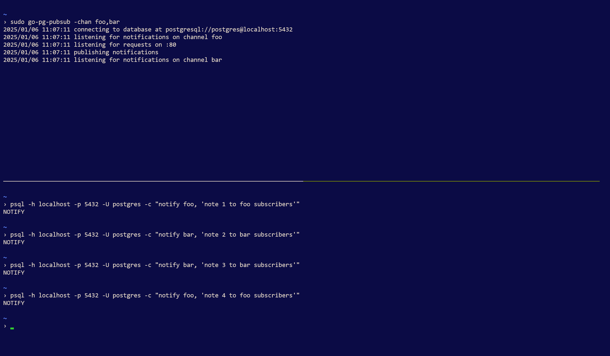
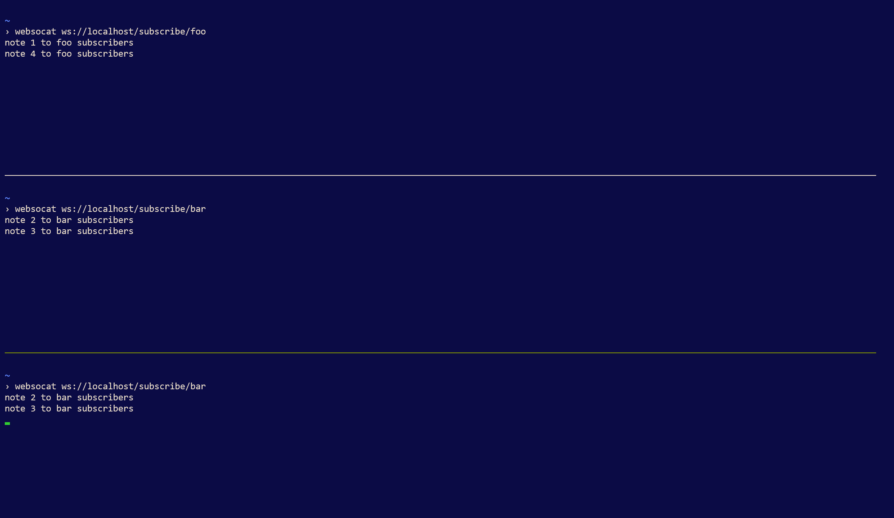

# Pub/sub for PostgreSQL notifications

A server, written in Go, that listens for PostgreSQL notifications and publishes to subscribers over websockets.

Primary use case is to publish notifications on database triggers events.

## Installation

```bash
git clone https://github.com/mbalkanloo/go-pg-pubsub.git
cd go-pg-pubsub
go build
go install
```

## Usage

```bash
Usage of go-pg-pubsub:
  -chan string
        comma-separated list of postgresql channels (ex. foo,bar)
  -conn string
        db connection string (default "postgresql://postgres@localhost:5432")
  -port string
        listen port (default "80")
```

Note: database and websocket connections are closed before exiting (via Ctl-C).

## Example

Assuming PostgreSQL running locally on port 5432 accepting passwordless connections from the postgres user.

Note that the server listens for subscribers on privileged port 80.

### Server session: start the server
```bash
sudo go-pg-pubsub -chan foo,bar
```

### Subscriber session 1: subscribe to foo
```bash
websocat ws://localhost/subscribe/foo
```

### Subscriber session 2: subscribe to bar
```bash
websocat ws://localhost/subscribe/bar
```

### Subscriber session 3: subscribe to bar
```bash
websocat ws://localhost/subscribe/bar
```

### PostgreSQL session: send notifications
```bash
psql -h localhost -p 5432 -U postgres -c "notify foo, 'note 1 to foo subscribers'"
```
```bash
psql -h localhost -p 5432 -U postgres -c "notify bar, 'note 2 to bar subscribers'"
```
```bash
psql -h localhost -p 5432 -U postgres -c "notify bar, 'note 3 to bar subscribers'"
```
```bash
psql -h localhost -p 5432 -U postgres -c "notify foo, 'note 4 to foo subscribers'"
```

### Screenshots





## TODO
  * Define a Notification type with an ID attribute representing a client ID.
  * Only send notifications the client is interested in via the ID attribute.
  * Allow clients to subscribe to all channels for their specific client ID.
  * Provide an example schema with associated triggers.
  * Handle SIGSEGV (segmentation violation) on exit. Function closures are accessing data structures and connections when exiting.
